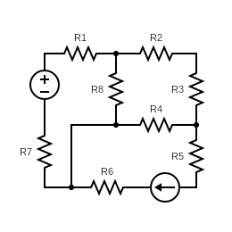

## Introduction

A circuit simulator is a program that takes a representation of a circuit and solves for all the currents and voltages as a function of time.

## Circuit Elements

In the code, a circuit element is represented with three properties: a positive node, a negative node, and a current. Each of these properties has a unique index that is assigned as the circuit element is created. By convention, the current flows from the positive node to the negative node.

## Circuit

The circuit is a class that includes a list of all the circuit elements, and can create new circuit elements. The circuit is also responsible for all the pre processing that need to be done before the circuit can be solved.

## Circuit System

This class can take certain "features" such as ohm's law or voltage sources and convert them into a linear system of equations that can be solved with various techniques of linear algebra.

## Connecting Elements

As mentioned before, the positive and negative terminals of each element have unique indices. That means that we need an object that will automatically manage a collection of sets that would represent the groups of the nodes that are connected to each other.

This operation will be implemented by a data structure that is called Union Find.

## UnionFind

UnionFind is a data structure that represents a collection of sets. Given a set of numbers, and the union of these numbers, UnionFind will keep track of which numbers are in the same union.

This is similar to how sets work but there is an important distinction. Applying a union to two sets could be described by "add all numbers from set A and set B to set C" (assuming no duplicates which is the case here). While UnionFind would be the following: "find the sets that contain the numbers a and b and combine these two sets".

Here is an example:

```
initial state
numbers:    1	2	3	4	5	6	7
unions:     a	b	c	d	e	f	g

union(1, 2)
numbers:    1	2	3	4	5	6	7
unions:     a	a	c	d	e	f	g

union(3, 4)
numbers:    1	2	3	4	5	6	7
unions:     a	a	d	d	e	f	g

union(2, 3)
numbers:    1	2	3	4	5	6	7
unions:     a	a	a	a	e	f	g
```

## Connecting Elements - API

Connecting two elements is accomplished by applying union on the negative terminal of the first element
with the positive terminal of the second element.

## Pre Processing - Assigning Voltages

Once the circuit is fully connected, a unique voltage index can be assigned to each group in the node's
UnionFind's union.

## Circuit Solve - Building the Matrix

Once the circuit has finished pre processing, it has a list of currents and voltages. These currents and
voltages will be the unknowns in the circuit system's
system of linear equations.

Then, the circuit will loop over each element and add the equation that describes the element to system.
For example:

$$
\begin{gather*}
\text{Resistor} & V_i - V_j - I_kR = 0 \\
\text{Voltage Source} & V_i = V_s \\
\text{Current Source} & I_i = I_s \\
\end{gather*}
$$

## Arbitrary Resistor Network

By this point the code is rich enough to be able to solve any combination of resistors, voltage sources,
and current sources.

Here is an example. On the left there is the code that builds the circuit. On the right there is a
diagram of the circuit. And on the bottom
there is the resulting system of equations and the solutions.

```cpp
Circuit circuit;

Resistor
* r1 = circuit.R(1),
* r2 = circuit.R(4),
* r3 = circuit.R(5),
* r4 = circuit.R(2),
* r5 = circuit.R(3),
* r6 = circuit.R(6),
* r7 = circuit.R(1),
* r8 = circuit.R(7);
VoltageSource
* vs = circuit.V(10);

CurrentSource
* is = circuit.I(5);

vs->connect(r1)->connect(r2)->connect(r3)
->connect(r5)->connect(is)->connect(r6)
->connect(r7)->connect(vs);

vs->connect(r1)->connect(r8)->connect(r7);

r3->connect(r4)->connect(r7);</code></pre>
```

```
circuit structure
elements: 10
nodes: 8
voltages: 8
currents: 10

type         V1           V2           V3           V4           V5           V6           V7           V8           I1           I2           I3           I4           I5           I6           I7           I8           I9           I10
ground       0.000000     0.000000     0.000000     0.000000     0.000000     1.000000     0.000000     0.000000     0.000000     0.000000     0.000000     0.000000     0.000000     0.000000     0.000000     0.000000     0.000000     0.000000     0.000000
Ohm          0.000000     -1.000000    1.000000     0.000000     0.000000     0.000000     0.000000     0.000000     -1.000000    0.000000     0.000000     0.000000     0.000000     0.000000     0.000000     0.000000     0.000000     0.000000     0.000000
Ohm          0.000000     0.250000     0.000000     0.000000     -0.250000    0.000000     0.000000     0.000000     0.000000     -1.000000    0.000000     0.000000     0.000000     0.000000     0.000000     0.000000     0.000000     0.000000     0.000000
Ohm          0.000000     0.000000     0.000000     0.000000     0.200000     0.000000     -0.200000    0.000000     0.000000     0.000000     -1.000000    0.000000     0.000000     0.000000     0.000000     0.000000     0.000000     0.000000     0.000000
Ohm          0.000000     0.000000     0.000000     0.000000     0.000000     0.000000     0.500000     -0.500000    0.000000     0.000000     0.000000     -1.000000    0.000000     0.000000     0.000000     0.000000     0.000000     0.000000     0.000000
Ohm          -0.333333    0.000000     0.000000     0.000000     0.000000     0.000000     0.333333     0.000000     0.000000     0.000000     0.000000     0.000000     -1.000000    0.000000     0.000000     0.000000     0.000000     0.000000     0.000000
Ohm          0.000000     0.000000     0.000000     0.166667     0.000000     0.000000     0.000000     -0.166667    0.000000     0.000000     0.000000     0.000000     0.000000     -1.000000    0.000000     0.000000     0.000000     0.000000     0.000000
Ohm          0.000000     0.000000     0.000000     0.000000     0.000000     -1.000000    0.000000     1.000000     0.000000     0.000000     0.000000     0.000000     0.000000     0.000000     -1.000000    0.000000     0.000000     0.000000     0.000000
Ohm          0.000000     0.142857     0.000000     0.000000     0.000000     0.000000     0.000000     -0.142857    0.000000     0.000000     0.000000     0.000000     0.000000     0.000000     0.000000     -1.000000    0.000000     0.000000     0.000000
V source     0.000000     0.000000     1.000000     0.000000     0.000000     -1.000000    0.000000     0.000000     0.000000     0.000000     0.000000     0.000000     0.000000     0.000000     0.000000     0.000000     0.000000     0.000000     10.000000
C source     0.000000     0.000000     0.000000     0.000000     0.000000     0.000000     0.000000     0.000000     0.000000     0.000000     0.000000     0.000000     0.000000     0.000000     0.000000     0.000000     0.000000     1.000000     5.000000
KCL          0.000000     0.000000     0.000000     0.000000     0.000000     0.000000     0.000000     0.000000     0.000000     0.000000     0.000000     0.000000     1.000000     0.000000     0.000000     0.000000     0.000000     -1.000000    0.000000
KCL          0.000000     0.000000     0.000000     0.000000     0.000000     0.000000     0.000000     0.000000     1.000000     -1.000000    0.000000     0.000000     0.000000     0.000000     0.000000     -1.000000    0.000000     0.000000     0.000000
KCL          0.000000     0.000000     0.000000     0.000000     0.000000     0.000000     0.000000     0.000000     -1.000000    0.000000     0.000000     0.000000     0.000000     0.000000     0.000000     0.000000     1.000000     0.000000     0.000000
KCL          0.000000     0.000000     0.000000     0.000000     0.000000     0.000000     0.000000     0.000000     0.000000     0.000000     0.000000     0.000000     0.000000     -1.000000    0.000000     0.000000     0.000000     1.000000     0.000000
KCL          0.000000     0.000000     0.000000     0.000000     0.000000     0.000000     0.000000     0.000000     0.000000     1.000000     -1.000000    0.000000     0.000000     0.000000     0.000000     0.000000     0.000000     0.000000     0.000000
KCL          0.000000     0.000000     0.000000     0.000000     0.000000     0.000000     0.000000     0.000000     0.000000     0.000000     0.000000     0.000000     0.000000     0.000000     1.000000     0.000000     -1.000000    0.000000     0.000000
KCL          0.000000     0.000000     0.000000     0.000000     0.000000     0.000000     0.000000     0.000000     0.000000     0.000000     1.000000     -1.000000    -1.000000    0.000000     0.000000     0.000000     0.000000     0.000000     0.000000
KCL          0.000000     0.000000     0.000000     0.000000     0.000000     0.000000     0.000000     0.000000     0.000000     0.000000     0.000000     1.000000     0.000000     1.000000     -1.000000    1.000000     0.000000     0.000000     0.000000

system solution:
-19.9558
7.78761
10
32.2124
2.12389
0
-4.95576
2.21239
2.21239
1.41593
1.41593
-3.58407
5
5
2.21239
0.79646
2.21239
5

current of voltage source: 2.21239
voltage over current source: 52.1682
```



## Capacitors

Capacitors are more complex than the previous elements we have dealt with. Opposed to sources and
resistors, the capacitor's equation is differential.
This means that even in a DC circuit, the solution will be time dependent.
$I = C\frac{dV}{dt}$
The circuit solver doesn't have "access" to the derivative $\frac{dV}{dt}$ because it is not one of
the knowns or the unknowns in the system's matrix.
Furthermore it cannot approximate it numerically because that would require to know the value of the
voltage in the next time step. However, at each point in time, the circuit
does have the value of the current.

For this reason, the circuit will model the capacitor as a voltage source, and at each time step it will
perform numerical integration over the current in order to update the voltage.
$V = \frac{1}{C} \int_0^tIdt'$
The numerical integration will be implemented as a recurrence relation
$V_{n+1} = V_n + \frac{1}{C} I\Delta t$
It is important to notice here that this recurrence relation reaches its final value when $I=0$ which
is exactly what happens with capacitors in real life - they become open circuits.

## Inductors

The idea behind inductors is the same as with capacitors. Starting with the linear differential
equation:
$V = L\frac{dI}{dt}$
Rewriting it as an integral:
$I = \frac{1}{L} \int_0^tVdt'$
Which then can be converted to a recurrence relation:
$I_{n+1} = I_n + \frac{1}{L} V\Delta t$
Inductors are modeled as current sources.

## Time Dependent Circuit Solver

As mention before Capacitors and Inductors are modeled as Sources whose values change in time. The
circuit solver, however, can solve the system at a specific point in time.

This means that after each solution, we need to update these special sources, increment the time counter
forward and solve again the system with the updated values.

## Example: RLC circuit

Here is an example. On the left - the code that builds the circuit. On the right - the circuit's
diagram.
And on the bottom - the resulting system of equations and the solutions at several time steps.

```cpp
Circuit circuit;

Resistor* r = circuit.R(4);
Capacitor* c = circuit.C(2);
Inductor* l = circuit.L(1);
VoltageSource* vs = circuit.V(10);

vs->connect(r)->connect(l)->connect(c)->connect(vs);
```

```
t: 0
type V1 V2 V3 V4 I1 I2 I3 I4
ground 0.000000 0.000000 1.000000 0.000000 0.000000 0.000000 0.000000 0.000000 0.000000
Ohm 0.250000 -0.250000 0.000000 0.000000 -1.000000 0.000000 0.000000 0.000000 0.000000
V source 0.000000 0.000000 1.000000 -1.000000 0.000000 0.000000 0.000000 0.000000 0.000000
C source 0.000000 0.000000 0.000000 0.000000 0.000000 0.000000 1.000000 0.000000 0.000000
V source 1.000000 0.000000 0.000000 -1.000000 0.000000 0.000000 0.000000 0.000000 10.000000
KCL 0.000000 0.000000 0.000000 0.000000 -1.000000 0.000000 0.000000 1.000000 0.000000
KCL 0.000000 0.000000 0.000000 0.000000 1.000000 0.000000 -1.000000 0.000000 0.000000
KCL 0.000000 0.000000 0.000000 0.000000 0.000000 -1.000000 1.000000 0.000000 0.000000
KCL 0.000000 0.000000 0.000000 0.000000 0.000000 1.000000 0.000000 -1.000000 0.000000

...

t: 0.54
type V1 V2 V3 V4 I1 I2 I3 I4
ground 0.000000 0.000000 1.000000 0.000000 0.000000 0.000000 0.000000 0.000000 0.000000
Ohm 0.250000 -0.250000 0.000000 0.000000 -1.000000 0.000000 0.000000 0.000000 0.000000
V source 0.000000 0.000000 1.000000 -1.000000 0.000000 0.000000 0.000000 0.000000 -1.629544
C source 0.000000 0.000000 0.000000 0.000000 0.000000 0.000000 1.000000 0.000000 -18.661737
V source 1.000000 0.000000 0.000000 -1.000000 0.000000 0.000000 0.000000 0.000000 10.000000
KCL 0.000000 0.000000 0.000000 0.000000 -1.000000 0.000000 0.000000 1.000000 0.000000
KCL 0.000000 0.000000 0.000000 0.000000 1.000000 0.000000 -1.000000 0.000000 0.000000
KCL 0.000000 0.000000 0.000000 0.000000 0.000000 -1.000000 1.000000 0.000000 0.000000
KCL 0.000000 0.000000 0.000000 0.000000 0.000000 1.000000 0.000000 -1.000000 0.000000
```

## Adaptive Time Steps

The method described above works well. However, it has one big flaw. In the RLC example the order of
magnitude of the capacitor and the inductors was
$10^1$ (which is huge, in most cases you would use a capacitor in the nano-farads range). And there
is a good reason for that. Let's inspect the capacitor's
recurrence relation again:
$V_{n+1} = V_n + \frac{1}{C} I\Delta t$
If the capacitance is too small, for example 1 nano-farads, then the same time step would drastically
change the voltage causing errors.
$V_{n+1} = V_n + 10^9 I\Delta t$
The solution to this problem is to assign each capacitor and inductor with its own time step, and pick
the lowest one for the simulation's time step.
