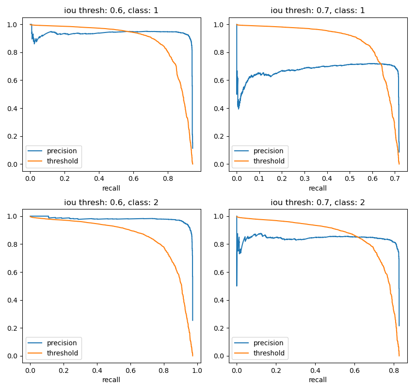

## Introduction

This article will explore several object detection neural networks, datasets, training techniques and evaluation measures.

## Mnist OD Dataset

[code](https://github.com/Cringere/exploring_object_detection/blob/master/custom_datasets/mnist_od_dataset.py)

Mnist is a famous dataset for object classification. It contains many hand-drawn digits all in 28x28 images. In object classification, this dataset is considered by many the easiest one to classify - if a network can't classify Mnist, there is no way it could classify a more complex dataset such as ImageNet.

We can create an analogous "easiest" object detection dataset by preparing a relatively large canvas, say 128x128 and scatter on it digits from mnist. The same argument could then be made - if an object detection network can't detect these digits - there is no way it could detect more complex objet on more complex datasets, like Pascal.

Here is an example of how an item from that dataset would look like (image and label):


```
[ {class: 8, center_x: 12, center_y: 13, width: 20, height: 20},
  {class: 5, center_x: 9, center_y: 26, width: 16, height: 16},
  {class: 9, center_x: 17, center_y: 42, width: 18, height: 18}, ]
```

## Network IO

This article follows YOLO's style of network architectures and loss design. Each input image is segmented into a grid of cells. For every cell, the network predicts a specific amount of bounding boxes. The amount of bounding boxes and the number of cells are hyper parameters. Each box contains the center $(x, y)$ and size $(w, h)$ relative to the cell of where it thinks an object exists as well as a probability of there being an object there at all. The method of predicting the class of the object varies from model to model.

for example the output shape with $c_a \times c_b$ cells, $c$ classes, and $b$ boxes per cell would be $(c_a, c_b, b, c + 5)$. The $+5$ is for the coordinates, size, and probability. Alternately, a different model could output a single class prediction per cell, in contrast to each class prediction per box. Then the output shape would be $(c_a, c_b, c + 5b)$.

Similarly, if the model expects only zero or one objects per cell, then the target shape would be $(c_a, c_b, c + 5)$. If the model expects more than one object per cell, then the label would have to be repeated for the maximum amount of allowed objects per cell: $(c_a, c_b, (c + 5) _ b)$.

The number of cells is a hyper parameter of the model, not the dataset, so object detection datasets contain their absolute coordinates and sizes in pixels. Additionally, these datasets would store their bounding boxes as lists, not tensors. For these reasons, before training, the raw dataset's labels need to be converted to relative cell sizes, and then to tensors. For example (canvas size is $256 \times 256 $):


```
[ {class: 0, center_x: 61, center_y: 86, width: 71, height: 130},
  {class: 1, center_x: 188, center_y: 145, width: 77, height: 72}, ]
```

```
[
  [ [1.00, 0.00, 1.00, 0.47, 0.67, 0.55, 1.01],
    [0.00, 0.00, 0.00, 0.00, 0.00, 0.00, 0.00], ],
  [ [0.00, 0.00, 0.00, 0.00, 0.00, 0.00, 0.00],
    [0.00, 1.00, 1.00, 0.46, 0.13, 0.60, 0.56], ],
]
```

## Yolo-V1 Loss

$$
\begin{align}
\text{loss} = &
\lambda_{\text{ coord }}
\sum_{i=0}^{S^2}
\sum_{j=0}^{B} \mathbb{1}_{ij}^\text{obj} \Big[
\big(x_i - \hat{x_i}\big) ^ 2 +
\big(y_i - \hat{y_i}\big) ^ 2
\Big] \\ & +
\lambda_{\text{ coord }}
\sum_{i=0}^{S^2}
\sum_{j=0}^{B} \mathbb{1}_{ij}^\text{obj}
\Big[
\big(\sqrt{w_i} - \sqrt{\hat{w_i}} \big) ^ 2 +
\big(\sqrt{h_i} - \sqrt{\hat{h_i}} \big) ^ 2
\Big] \\ & +
\sum_{i=0}^{S^2}
\sum_{j=0}^{B} \mathbb{1}_{ij}^\text{obj} \Big(
C_i - \hat{C_i}
\Big) ^ 2 \\ & +
\lambda_{\text{ noobj }}
\sum_{i=0}^{S^2}
\sum_{j=0}^{B} \mathbb{1}_{ij}^\text{noobj} \Big(C_i - \hat{C_i} \Big) ^ 2 \\ & +
\sum_{i=0}^{S^2} \mathbb{1}^\text{obj}
\sum_{c\in \text{classes}} \Big( p_i(c) - \hat{p}_i(c) \Big) ^ 2
\end{align}
$$

Where $x_i, y_i, w_i, h_i$ are the coordinates and sizes of the predicted boxes. $\hat{x_i}, \hat{y_i}, \hat{w_i}, \hat{h_i}$ are the target boxes.

$C_i$ is the predicted probability of an object being in the bounding box of cell $i$. $\hat{C_i}$ is the target probability. When there is an object, $\hat{C_i}$, and when there isn't $\hat{C_i}=0$.

$\mathbb{1}_{ij}^\text{obj}$ is an identity function: $1$ when cell $i$ has a target box, and bounding box $j$ is responsible for predicting it, $0$ otherwise. $\mathbb{1}_{ij}^\text{noobj}$ is the opposite: $1 - \mathbb{1}\_{ij}^\text{obj}$.

$\mathbb{1}\_i^\text{obj}$ is also an identity function: $1$ when cell $i$ has a target box, $0$ otherwise.

$p_i(c)$ is the predicted probability of class $c$. $\hat{p_i(c)}$ is the target probability of class $c$. $\hat{p_i(c)}$ is either $0$ or $1$.

Notice the difference between $C_i$ and $p_i(c)$. First, $C_i$ is used to determine if there is an objet at all or not, and then $p_i(c)$ is used to determine what class the object belongs to.

In cells that contain objects, the predicted box that counts as being the responsible one for the prediction, is the one that has the highest IOU (intersection over union) with the target box. Unlike inference, the selected predicted box for each cell is a function of both the network's output and the target label.


## Yolo Loss Implementation

[code](https://github.com/Cringere/exploring_object_detection/blob/master/custom_losses/yolo_loss.py)

The biggest challenge in implementing the Yolo loss is writing it with as many vectorized operations, avoiding explicit control flow. There are many ways of doing so, and the method described in this section is just one of them.

Note:
<br>
In the Yolo loss the cells are flattened and indexed from $0$ to $S^2$. In this implementation the cells are left in their grid form and indexed from $(0, 0)$ to $(S, S)$.

The predicted boxes tensor has the shape:

$$
\text{pred}: (\text{batch}, \text{cells\_a}, \text{cells\_b}, \text{classes} + 5b)
$$

The label boxes tensor has the shape:

$$
\text{label}: (\text{batch}, \text{cells\_a}, \text{cells\_b}, \text{classes})
$$

First, split all the cells into ones that have labeled objects and ones that don't. This is similar to the $\mathbb{1}\_i^\text{obj}$.

```python
i_obj = pred[:, :, :, classes] > 0.5
```

Note:
<br>
since the classes's indices range from $0$ to $\text{classes} - 1$, the probability's index is $\text{classes}$. The number $0.5$ is arbitrary here, since the label's probabilities are always $0$ or $1$.

Then the cells are extracted:

```python
label_obj = label_obj[i_obj]
pred_obj = pred_obj[i_obj]
```

This operation will flatten the tensors such that the new shapes will be:

$$
\begin{align}
\text{pred\_obj}: (\text{x}, \text{classes} + 5b) \\
\text{label\_obj}: (\text{x}, \text{classes} + 5)
\end{align}
$$

The same can be done for cells that don't have cells. This will
be similar to the $\mathbb{1}\_i^\text{noobj}$ function:

```python
i_noobj = pred[:, :, :, classes] &lt 0.5
label_noobj = label_noobj[i_noobj]
pred_noobj = pred_noobj[i_noobj]</code>
```

And the shapes:

$$
\begin{align}
\text{pred\_noobj}: (\text{y}, \text{classes} + 5b) \\
\text{label\_noobj}: (\text{y}, \text{classes} + 5) \\
\end{align}
$$

Such that $\text{x} + \text{y} = \text{batch} \cdot \text{cells\_a} \cdot \text{cells\_b}$ since every cell either has an object or doesn't.

Since all the predicted boxes for each cell share the same class probabilities it can be helpful to separate them:

```python
pred_obj_classes = pred_obj[:, :classes]
pred_obj_boxes = pred_obj[:, classes:]
label_obj_classes = label_obj[:, :classes]
label_obj_boxes = label_obj[:, classes:]
```

And the resulting shapes:

$$
\text{pred\_obj\_classes}: (\text{x}, \text{classes})
$$

$$
\text{pred\_obj\_classes}: (\text{x}, 5b)
$$

$$
\text{label\_obj\_classes}: (\text{x}, \text{classes})
$$

$$
\text{label\_obj\_boxes}: (\text{x}, 5b)
$$

The next step is to reduce$(\text{x}, 5b)$ into $(\text{x}, 5)$ by choosing the responsible box. As stated in the previous section, the responsible box from each of the $b$ predicted ones is the one with the highest IOU with respect. to the label box. The IOU calculation consists out of a few simple arithmetic operations which means its input tensors must have the same shapes.

[IOU code](https://github.com/Cringere/exploring_object_detection/blob/master/utils/__init__.py)

One way matching between the predictions and the labels is to first, reshape the predicted boxes such that each box is on its own vector, and repeat the label boxes such that each predicted box will have its corresponding duplicated label box.

$$
\begin{align*}
\text{pred\_obj\_boxes}: &(\text{x}, 5b) \rightarrow (\text{x}, b, 5) \\
\text{label\_obj\_boxes}: &(\text{x}, 5) \rightarrow (\text{x}, 1, 5) \rightarrow (\text{x}, b, 5)
\end{align*}
$$

then, the indices of the boxes with highest iou are calculated and
stored in a vector using $\arg\max$:

```python
indices = argmax(iou(pred_obj_boxes, label_obj_boxes))
```

$$
\text{indices}: (\text{x}, )
$$

Getting the actual boxes from the indices is a bit more complicated.
The goal is to create a tensor such that:

```python
collected[i, j] = pred_obj_boxes[i, indices[i], j]
```

The accompanying code to this article is written in a [pytorch](https://pytorch.org) which has a similar function: [gather](https://pytorch.org/docs/stable/generated/torch.gather.html). `gather` allows to perform the following action:

```python
out[i, j, k] = input[i, index[i][j][k], k]
```

Which is quite similar to what is actually needed. Specifically, if the indices are reshaped to add another dimension and then repeated on their last dimension:

$$
\text{indices}: (\text{x}, ) \rightarrow (\text{x}, 1, 1) \rightarrow (\text{x}, 1, 5)
$$

They match exactly the format required by [gather](https://pytorch.org/docs/stable/generated/torch.gather.html). The result would a tensor containing the boxes with the maximum IOUs, which can be easily reshaped to remove the unnecessary dimension.

$$
\text{pred\_obj\_boxes\_max}: (\text{x}, 1, 5) \rightarrow (\text{x}, 5)
$$

Finally the losses can be calculated ($\text{mse}$ stands for mean squared loss with a summation reduction):

$$
\sum\_{i=0}^{S^2}
\sum\\\_{j=0}^{B} \mathbb{1}\\\_{ij}^\text{obj} \Big[
\big(x_i - \hat{x_i}\big) ^ 2 +
\big(y_i - \hat{y_i}\big) ^ 2
\Big]
$$

```python
mse(
    label_obj_boxes[..., 1: 3],
    pred_obj_boxes_max[..., 1: 3]
)
```

The sizes loss is slightly more complex because it has a squared root term. If nothing stops the network from outputting negative values, a division error will occur. In the yolo paper, the square root is as an absolute scale factor so it doesn't matter if the number is negative or not - its absolute value needs to be scaled.

$$
\sum\_{i=0}^{S^2}
\sum\_{j=0}^{B} \mathbb{1}\_{ij}^\text{obj} \Big[
\big(\sqrt{w_i} - \sqrt{\hat{w_i}} \big) ^ 2 +
\big(\sqrt{h_i} - \sqrt{\hat{h_i}} \big) ^ 2
\Big]
$$

```python
def q(x):
    return sign(x) * sqrt(abs(x))

    mse(
        q(label_obj_boxes[..., 3: 5]),
        q(pred_obj_boxes_max[..., 3: 5])
    )
```

The probability is just like the location loss:

$$
\sum\_{i=0}^{S^2}
\sum\_{j=0}^{B} \mathbb{1}\_{ij}^\text{obj} \Big(
C_i - \hat{C_i}
\Big) ^ 2
$$

```python
mse(
    label_obj_boxes[..., 0],
    pred_obj_boxes_max[..., 0]
)
```

`The probability for the cells without objects is different since all the boxes they contain need to be added to the loss. The probabilities indices of these boxes are $\text{classes}, \text{classes} + 5, ..., \text{classes} + 5b$ In [pytorch](https://pytorch.org), specific indices can be extracted using the
$\text{index\_select}$ function:

$$
\sum_{i=0}^{S^2}
\sum_{j=0}^{B} \mathbb{1}_{ij}^\text{noobj} \Big(
C_i - \hat{C_i}
\Big) ^ 2
$$

```python
mse(
    index_select(pred_no_obj, -1, pred_prob_indices).squeeze(-1),
    label_no_obj[..., probability_index]
)
```

The final item is very similar to the location loss, but instead of having the identity function over cells and boxes, the identity function is over cells only:

$$
\sum\_{i=0}^{S^2} \mathbb{1}^\text{obj}
\sum\_{c\in \text{classes}} \Big(
p_i(c) - \hat{p}\_i(c)
\Big) ^ 2 =
$$

```python
mse(
    label_obj[..., :classes],
    pred_obj[..., :classes]
)
```

## First Model

[architecture](https://github.com/Cringere/exploring_object_detection/blob/master/mnist_od/net.py)
[training](https://github.com/Cringere/exploring_object_detection/blob/master/mnist_od_train.py)
[testing](https://github.com/Cringere/exploring_object_detection/blob/master/mnist_od_test.py)

This model is built of a series of same-padding convolutions of various sizes, 1x1 convolutions and max pool layers. Its inputs are batches of images with shape $(1, 128, 128)$ and its output is a batch of predicted bounding boxes $(4, 4, 20)$, where $4$ is the number of cells per row and columns, there are $10$ classes, and $2$ predicted boxes per cell. The output values of the network that were responsible for probabilities - box confidence and class probabilities were also ran through a sigmoid.

The network was trained on the mnist-od dataset (presented above) with $16392$ items, batch size of $64$ and $10$ epochs. Here are the losses (excluding the first few hundred iterations):


Testing the dataset (red are target boxes, green are predicted boxes with $>70\%$ confidence):


## Model evaluation - mAP

[code](https://github.com/Cringere/exploring_object_detection/blob/master/mnist_od_stats.py)
[mAP](https://github.com/Cringere/exploring_object_detection/blob/master/utils/__init__.py)

Sampling a few images from the dataset and visually drawing their bounding boxes is a great tool for visualization, but it doesn't provide a concrete metric for how well the model is doing. For that, there exists the mean average precision (mAP) metric.

mAP relies on two key concepts - precision and recall. Precision is the number of true positive predictions over the sum of both the true positives and the false positives. Basically, its the number of correctly predicted boxes out of all the predictions.

Recall is the number of true positive predictions over the sum of both the true positive and the false negative predictions - which are basically the number of target boxes.

mAP is calculated for a specific IOU threshold. When a predicted box and a target box have an iou thats about the threshold, the target box counts as a true positive, otherwise it is counted as a false positive.


in mAP there exists another threshold - the confidence threshold. This threshold controls which boxes count as predictions and which are ignored.

The fist step in calculating the mAP is plotting a precision vs recall graph. Each point on that graph, is calculated using a specific confidence threshold. The idea is that starting from $100%$ the confidence threshold is gradually lowered to $0%$ while the precision and recall calculated.

As long as as the range $[0\%, 100\%]$ is segmented into enough points, it doesn't really matter how it is segmented. However, one efficient way of choosing these segments is to sort all the predicted boxes from highest confidence to lowest and using their confidences as the thresholds. This way, each time the threshold is lowered, only one additional box changes its status from being an ignored box to a predicted box.

Here is are the plots for precision and confidence threshold vs recall for each of the classes and each several ious. The additional line of the thresholds is not necessary but visually useful, it allows you to see what the precision and recall were at each specific threshold.



These graphs are calculated for a specific IOU and class. Average precision is the area under these graphs. The mean average precision is the is calculated by averaging those areas with respect to the classes. Plotting the mAP vs IOU produces the following graph:


## Second Model

[architecture](https://github.com/Cringere/exploring_object_detection/blob/master/voc_od/nets.py)
[training](https://github.com/Cringere/exploring_object_detection/blob/master/voc_od_train.py)

The goal of the second model is to work detect objects in the {{@ links/pascal_voc}} dataset. Compared to the mnist od dataset, this is dataset contains real life images with real life objects to detect. Obviously this task is much more difficult than the previous one.

When dealing with extremely difficult tasks, it is sometimes easier to first train a network on an easier one, and then transfer it (with some differences) to the new task. This network has three parts - a base, a classification head, and a detection head. when the base is paired with the classification head, the networks output, is a one-hot vector - a common classification encoding. When the base is paired with the detection head, the networks output is a a list of bounding boxes, just as in the previous network.

During the training process, a base and a classification head are both trained on {{@ links/image_net}}. Then, the classification head is thrown away, and the base is paired with a detection head. This is the final architecture of the network is it is trained until a sufficiently small loss.

## Second Model evaluation - mAP

[derivation](https://github.com/Cringere/exploring_object_detection/blob/master/voc_od_map_derivation.ipynb)
[statistics](https://github.com/Cringere/exploring_object_detection/blob/master/voc_od_stats.py)

Calculating the mAP for this model is very similar to the previous. In the previous model, in order for a predicted box count as a true positive its center needed to be in the same cell as its target. This is a simplification that worked in the previous model because all objects were roughly the same size and aspect ratio. In this model, the bounding boxes need to be converted from their relative coordinates systems (the cell's coordinate system) to absolute system (absolute in terms of the whole image).

This difference creates an extra complication. Now, each image in the batch has a different amount of predicted boxes and labels, and the iou of each pair of prediction and target needs to be calculated. For a detailed walk through the algorithm consult the "derivation" link above.

Here are some result after training the network (not to completion):


