import CanvasInit from "./comp/CanvasInit.astro";
import CanvasWithGlsl from "./comp/CanvasWithGlsl.astro";

<CanvasInit />

## Introduction

Commonly, I find myself needing a background grid when working with OpenGL. Since grids are made of patterns that can be defined with simple equations, they are perfect for rendering
with a fragment shader.

## Checkerboard

The input to the shader is a rectangle, with uv coordinates ranging from $(0, 0)$ at to bottom left to $(1, 1)$ at to top left.

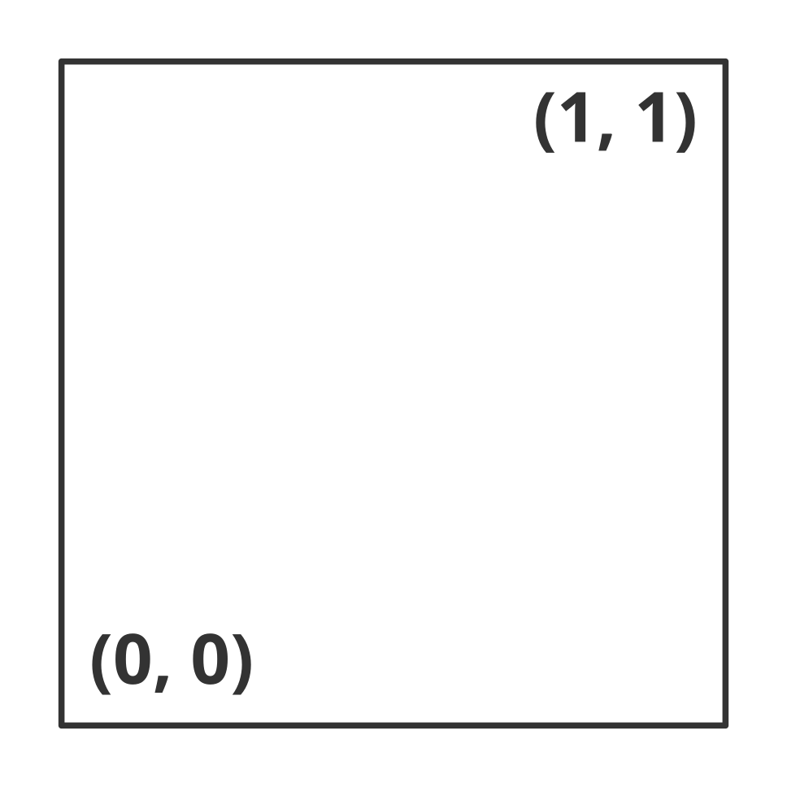

Then coordinates are transformed such that the corners of the camera correspond to the corners of the viewport. These are the 'world' coordinates.

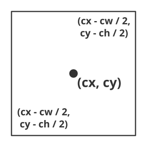

Using the world coordinates and the location of the grid, a mask can be created - a variable whose value is $1$ if the point in the world coordinates is inside the grid and $0$ otherwise.

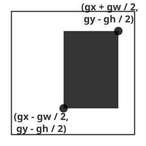

Then, two operations are performed: the coordinates are translated such that $(0, 0)$ is at the bottom left corner or the grid, and then modded with twice the size of the grid's cell size.

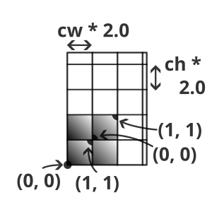

Each of the modded sections are then tested where $x \lt 0.5$ and $y \lt 0.5$.

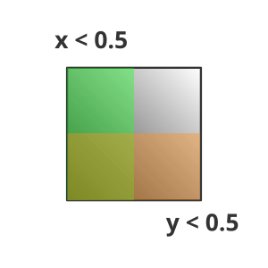

Based on the above, sections can be tested for being on the diagonal and on the off-diagonal.

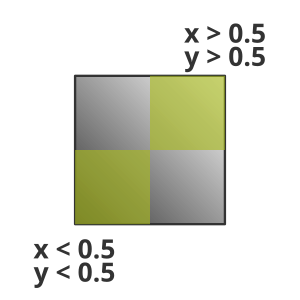

The result:

<CanvasWithGlsl vert="grid_01_vert" frag="grid_01_frag" />

## Line Grid

This shader is very similar to the previous one. In this shader, the coordinates are modded with the cell size (instead of twice the cell size). The goal is to fill a small area near the borders of the cells while keeping their insides transparent.

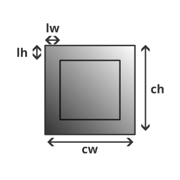

Checking if a point is near the borders reduces to constructing the following function:

$$
f(x) = \begin{cases}
1\ \ \text{if}\ (x \lt l)\ \text{or}\ (x \gt 1.0 - l) \\
0\ \ \text{otherwise} \\
\end{cases}
$$

Where $x \in [0, 1]$. This function is symmetric around $0.5$, so it can be simplified to:

$$
f(x) = \begin{cases}
1\ \ \text{if}\ (-|x - 0.5| + 0.5 \lt l)\ \\
0\ \ \text{otherwise} \\
\end{cases}
$$

Which can be neatly expressed with GLSL's step function.

The Result:

<CanvasWithGlsl vert="grid_01_vert" frag="grid_02_frag" />

## Hex Grid

Using the radius of the hexagon, its width and height can be calculated:

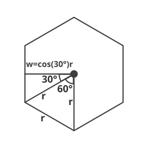

The next step is to draw a single hexagon. This will be a function that will return $1$ for points inside the hexagon and $0$ for points outside. The hexagon will be assumed to be centered at $(0, 0)$ with radius $r$. Using symmetry, the function can be simplified to test only positive points.

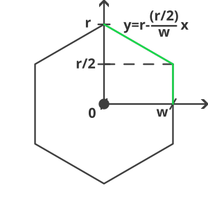

$$
h(x, y) = \begin{cases}
1\ \ \text{if}\ (x \lt w)\ \text{and}\ (y \lt r-\frac{r}{2w}x) \\
0\ \ \text{otherwise} \\
\end{cases}
$$

Two hexagons can be put together by translating the coordinates
by the width. Each hex can be multiplied by a different color.

$$
h(x, y)\vec{c_1} + h(x - 2w)\vec{c_2}
$$

Then, the two hexagons can be made into a row with the $\text{mod}$ function.
When repeating shapes using $\text{mod}$ it is important to place
the entire position in the positive quadrant otherwise the shape
will be cut. So the hexes are shifted to the right by $w$ and
to the top by $r$.

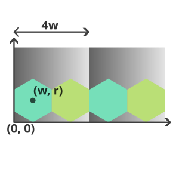

Then, the top operations can be called again but with a shift of half a hexagon and different colors.

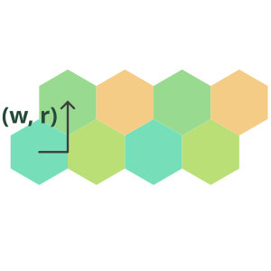

Then, each row is modulated in the $y$ direction by $(y \mod 3r)$. $3r$ is the distance between two hex rows.

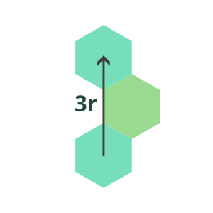

Finally each of the rows need to modulated _separately_ The reason for that is that only rectangular regions can be modulated and two hexagonal rows are not rectangular. Modulating the two rows together would end up with missing regions.

<CanvasWithGlsl vert="grid_01_vert" frag="grid_03_frag_together" />

Here is the result with separate modulation:

<CanvasWithGlsl vert="grid_01_vert" frag="grid_03_frag" />
