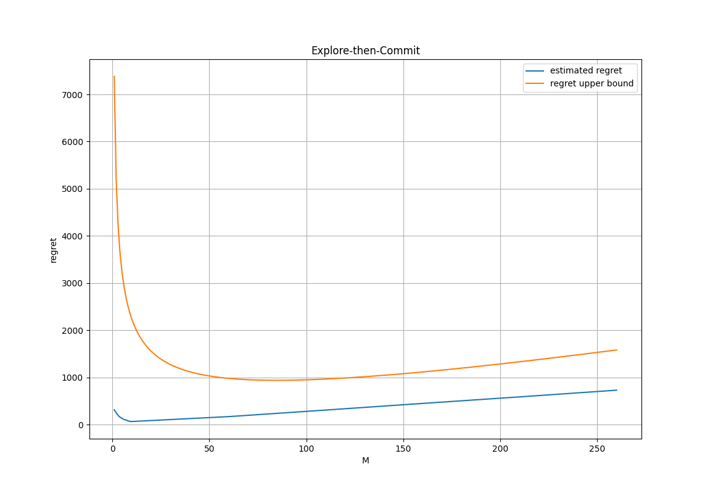

## Terms and Notation

- $X$- random variable.
  - Abbreviated as R.V.
- i.i.d - Independent and identically distributed.
- $\mathbb{E}[\square]$ - Expectation.
- $\mu$ - Mean.
- $\hat\square$ - the hat specifies the empirical analogue of a quantity.
  - For example $\hat\mu$ is the empirical mean, or average.
- MAB - Multi Arm Bandit(s).
- $\square^c$ - event's complement.

## Prerequisites

### Markov's Inequality

- [wiki](https://en.wikipedia.org/wiki/Markov%27s_inequality)

$$
X\ge 0,\ a > 0:\quad P(X\ge a) \le \frac{\mathbb{E}[X]}a
$$

For a non-negative random variable $X$ and a positive constant $a$, the probability that $X$ will be greater than $a$ is no more than $\frac{\mathbb{E}[X]}a$.

At first this might seem confusing because what does an expression of the form $P(X\ge a) \le \frac{\mathbb{E}[X]}a$ actually mean? What does it mean for a probability be less than something? Simply, it means that for any _specific_ choice of $X$ and $a$ there will be an exact value for $P(X\ge a)$, after all, every random variable has a distribution, regardless of its known or unknown. This expression means that _regardless_ of your _specific_ choice of $X$ and $a$, the _true_ value of $P(X\ge a)$ cannot be larger than $\frac{\mathbb{E}[X]}a$.

This inequality comes in handy when considering the variance of a R.V.

$$
\text{Var}(X)=E\Big[\big(X-\mathbb[X]\big)^2\Big]
$$

Notice that $(X-E[X])^2$ is a non negative R.V. Therefore, we can apply Markov's inequality to it.

$$
P(X\ge a) \le \frac{\mathbb{E}[X]}a \implies a P(X\ge a) \le \mathbb{E}[X] \implies
\mathbb{E}[X] \ge a P(X\ge a)
$$

$$
\text{Var}(X)=\mathbb{E}[(X-\mu)^2]\ge P\left((X-\mu)^2\ge a^2\right)a^2=P\left(|X-\mu|\ge a\right)a
$$

$$
P(|X-\mu|\ge c)\le\frac{\text{Var}(X)}{c^2}
$$

### Chernoff bound

- [wiki](https://en.wikipedia.org/wiki/Chernoff_bound)

$$
t>0, \forall X:\quad P(X\ge a)=P(e^{tX}\ge e^{ta})\le \mathbb{E}[e^{tx}]e^{-ta}
$$

$$
\implies P(X\ge a)\le \inf_{t>0} \mathbb{E}[e^{tx}]e^{-ta}
$$

Chernoff's bound is an application of [Markov's-Inequality](#markovs-inequality) to the random variable $e^{tx}$. It holds for any R.V $X$. The _bound_ appears when we take the infimum ([wiki](https://en.wikipedia.org/wiki/Infimum_and_supremum)) of $t>0$. In other words, we let $t$ approach $0$ from the positive numbers while never reaching it.

### Hoeffding's Inequality

- [wiki](https://en.wikipedia.org/wiki/Hoeffding%27s_inequality)

Hoeffding's Inequality bounds the probability of the average of $m$ i.i.d R.Vs ([wiki](https://en.wikipedia.org/wiki/Independent_and_identically_distributed_random_variables)) to exceed a certain distance from their true mean. Each random variable is bounded by $a_i\le X\le b_i$.

$$
\begin{aligned}
\text{i.i.d R.Vs}: &  & & X_1,\cdots,X_m\quad X_i\in[a_i, b_i] \\
\text{average}: & & \hat\mu & = \frac{1}{m}\sum_i X_i \\
\text{mean}: & & \hat\mu & = \mathbb{E}[X_i],\quad \forall X_i
\end{aligned}
$$

$$
P(\hat\mu-\mu\ge t)\le\exp\left(\frac{-2t^2m^2}{\sum_i (b_i-a_i)^2}\right)
$$

$$
P(\left|\hat\mu-\mu\right|\ge t)\le2\exp\left(\frac{-2t^2m^2}{\sum_i (b_i-a_i)^2}\right)
$$

The last two lines are the two main forms of Hoeffding's inequality. However, depending on the use case, people sometimes write it slightly differently. For example if we assume that $0\le X_i \le 1$, then the denominator on the right hand side becomes $m$.

Sometimes, it is more convenient to consider a parameter $\delta$ which represents the right hand side of the inequality. It can be easier to have an expression of the form $P(\hat\mu-\mu\ge\square)\le \delta$.

$$
\begin{aligned}
& \delta = \exp\left(\frac{-2t^2m^2}{\sum_i (b_i-a_i)^2}\right) \\
&  \ln \delta= \frac{-2t^2m^2}{\sum_i (b_i-a_i)^2} \\
&  \ln \delta= t^2\frac{-2m^2}{\sum_i (b_i-a_i)^2} \\
&  \ln \delta \frac{\sum_i (b_i-a_i)^2}{-2m^2} = t^2 \\
&  \sqrt{\frac{\ln(\delta)\sum_i (b_i-a_i)^2}{-2m^2}} = t \\
& \implies
P\left(\hat\mu-\mu\ge \sqrt{\frac{\ln(\delta)\sum_i (b_i-a_i)^2}{-2m^2}}\right)\le \delta
\end{aligned}
$$

### Union Bound / Boole's inequality

- [wiki](https://en.wikipedia.org/wiki/Boole%27s_inequality)

$$
P \left( \bigcup_i A_i\right) \le \sum_i P(A_i)
$$

Union Bound states that the probability of a union over a set of events $\set{A_i}$ is at most the sum of the probabilities of the individual events.

There is another interpretation to the above equation. Taking the union over a set of events, is like creating a single encompassing event that becomes _"true"_ whenever at least one of the individual events become _"true"_.

$$
P \left(\exists i:\; A_i \right) \le \sum_i P(A_i)
$$

Union Bound is so useful because it can be combined with different inequalities. For example consider a set of $n$ sets, each with $m$ i.i.d R.Vs. For simplicity lets assume that they are also bounded by $[0,1]$. Then,

$$
\set{
    \set{X_{1,1},\cdots,X_{1,m}},
    \set{X_{2,1},\cdots,X_{2,m}},
    \cdots,
    \set{X_{n,1},\cdots,X_{n,m}}
}
$$

Then, using Hoeffding's Inequality, we know that each set independently satisfies:

$$
P(\hat\mu_i-\mu\ge t)\le\exp\left(-2t^2m\right), \quad \hat\mu_i = \frac{1}{m}\sum_j X_{i,j}
$$

Now, we can assign $A_i$ to be the event of $\hat\mu_i-\mu\ge t$ happening such that $P(\hat\mu_i-\mu\ge t)=P(A_i)$. Then, we can apply Union Bound:

$$
P(\exists i:\; \hat\mu_i-\mu\ge t) = P\left(\bigcup_i A_i\right) \le \sum_i P(A_i)= n\exp\left(-2t^2m\right)
$$

## Introduction

MAB can be thought of as a game that consists of $T$ rounds. At each round the player chooses an action out of $k$ possible actions. Each action can be thought of "pulling an arm" (the terminology comes from gambling machines). After being pulled, an arm gives a reward to the player. For this article we will assume that the rewards are bounded in $[0,1]$. The arms are independent of each other and have some randomness to them.

Formally, lets define the following variables.

- $T$ - number of rounds.
- $\mu_i$ - expected reward of pulling arm $i$.
- $\mu^*=\max_i \mu_i$ - expected reward of the best arm.
- $a^*=\arg\max_i \mu_i$ - action corresponds to pulling the best arm.
- $r_t(a_i)$ - the reward of taking action $a_i$ at time $t$.
- $\mathcal{A}=\set{a_1,\cdots,a_k}$ - set of possible actions.
- $a_t$ - the action the player chose at time $t$.

Notice that if the player knew the expected rewards of all the arms, then the problem would be trivial - the best action would be to pick the arm with the largest expected reward. The difficulty of MAB comes from the lack of knowledge - the player doesn't know anything about the model, and the only input he has is the immediate reward he received from the arm he pulled.

In order to measure different strategies, mathematicians have developed a concept called _Regret_ - a measurement of how much the player _could_ have done better. Before working with the actual _Regret_ definition, consider the following _problematic_ formula, lets call it Naive Regret:

$$
\text{Naive Regret} = \max_{i\in A}\sum_{t=1}^T r_t(i) - \sum_{t=1}^T r_t(a_t)
$$

The issue with this formula is that $r_t(i)$ is a R.V, meaning that even if the player had full knowledge about the model, he still wouldn't be able to minimize his regret. In fact, the _Naive Regret_ itself is a R.V. To understand this point, lets consider a model with two arms with $\mu_1=\mu^*=0.9$ and $\mu_2=0.1$. Clearly, choosing action $1$ is the optimal one, however, due to randomness, in some rare cases the reward of action $2$ will be larger than the reward of action $1$. Lets see this in action:

```py
import numpy as np
from random import random

# Bernoulli distributions have the property`μ=p`.
def rand_bernoulli(p):
    return 1 if random() < p else 0

games = 1000000
T = 10

mu_1 = 0.9
mu_2 = 0.1

def game():
    r1 = [rand_bernoulli(mu_1) for _ in range(T)]
    r2 = [rand_bernoulli(mu_2) for _ in range(T)]

    naive_regret = sum(max(r1[i], r2[i]) for i in range(T)) - sum(r1)
    return naive_regret

# E[Naive Regret] ≈ 0.1
print(np.average([game() for _ in range(games)]))
```

The above code shows that in expectation, the naive regret is about $0.1$.

A more reasonable definition of Regret is as follows:

$$
\text{Regret} =\max_i\mathbb{E}\left[\sum_{t=1}^T r_t(i)\right]-\mathbb{E}\left[\sum_{t=1}^Tr_t(a_t)\right]=\mu^*T-\sum_{t=1}\mu_{a_t}
$$

Firstly, the _Regret_ is not a R.V, secondly, given full knowledge of the model, a player could in theory choose $a_t=a^*$ and get a regret of $0$.

## Example: Full Round Information

This is a simple example does **not** follow the formal definition of MAB. I'm showing it here because it is simpler to understand than the the analysis of the formal version of MAB and it shows an interesting fact that we will get to by the end of this section.

In this example there are only two arms ($k=2$). In each round $t$ the player chooses an action $a_t$, receives the reward $r_t(a_t)$, however he gets to observe the rewards of both arms (This is why it's different from the usual MAB). The strategy of the player is at time $t$ to choose the arm whose average reward the highest up to $t$.

For the analysis, without loss of generality lets say that arm $1$ is the optimal one: $\mu^*=\mu_1>\mu_2$. Then, we can define a helper variable $\Delta=\mu_1-\mu_2$.

We will start the analysis by writing an expression for the regret:

$$
\begin{aligned}
\text{Regret} & =  \mu^*T-\sum_{t=1}\mu_{a_t} \\
& =  \sum_{t=1}^T\left[\mu_1-\mu_{a_t}\right] \\
& =  \sum_{t=1}^T\left[\mu_1-\left(P(a_t=1)\mu_1 +P(a_t=2)\mu_2\right)\right] \\
& =  \sum_{t=1}^T\left[\mu_1-\left(P(a_t=1)\mu_1 +(1-P(a_t=1))\mu_2\right)\right] \\
& =  \sum_{t=1}^T\left[\mu_1-\left(P(a_t=1)\mu_1 +\mu_2-P(a_t=1)\mu_2\right)\right] \\
& =  \sum_{t=1}^T\left[\mu_1-P(a_t=1)\mu_1 -\mu_2+P(a_t=1)\mu_2\right] \\
& =  \sum_{t=1}^T\left[\mu_1-\mu_2 +P(a_t=1)(-\mu_1 + \mu_2)\right] \\
& =  \sum_{t=1}^T\left[\Delta - \Delta P(a_t=1)\right] \\
& =  \Delta\sum_{t=1}^T\left[1- P(a_t=1)\right] \\
& =  \Delta\sum_{t=1}^TP(a_t=2) = \Delta\sum_{t=1}^T P(\text{avg}_t(2)>\text{avg}_1(2))  \\
\end{aligned}
$$

So, in order to calculate the regret, we need to calculate the probability that at each round, the average reward of the second arm will be greater than the average reward of the first arm. Notice that the average reward is a sum of i.i.d random variables, whose true mean is known to us:

$$
\begin{aligned}
& \text{avg}_t(i) = \frac{1}{t}\sum_{\tau=1}^{t}r_t(i) \\
& \forall t,i: \mathbb{E}[r_t(i)] = \mu_i
\end{aligned}
$$

Therefore, the difference between the averages is also a random variable with a known mean.

$$
\begin{aligned}
& \text{avg}_t(2)-\text{avg}_t(1) = \frac{1}{t}\sum_{\tau=1}^{t}[r_t(2)-r_t(1)] \\
& \forall t,i: \mathbb{E}[\text{avg}_t(2)-\text{avg}_t(1)] =\mu_2-\mu_1=-\Delta
\end{aligned}
$$

This is useful since through a bit of algebra, we will be able to get this to a form appropriate for Hoeffding's Inequality.

$$
\begin{aligned}
P(\text{avg}_t(2) \ge \text{avg}_t(1)) & = P(\text{avg}_t(2) - \text{avg}_t(1) > 0) \\
& = P((\text{avg}_t(2) - \text{avg}_t(1)) - \Delta > \Delta) \\
& \le \exp\left(-2\Delta^2t\right) \\
\end{aligned}
$$

Which can then be plugged into the formula we derived for the regret:

$$
\begin{aligned}
\text{Regret} & =  \mu^*T-\sum_{t=1}\mu_{a_t} \\
& = \Delta\sum_{t=1}^T P(\text{avg}_t(2)>\text{avg}_1(2))  \\
& \le \Delta\sum_{t=1}^T \exp\left(-2\Delta^2t\right)  \\
& \le \Delta\int_{t=0}^T \exp\left(-2\Delta^2t\right)dt \\
& = \frac{1}{2\Delta} \\
\end{aligned}
$$

Notice how in this full information case of MAB, the upper bound of the regret doesn't depend on $T$. We will show in the next section that in general this is impossible. In general, when only the reward of the taken action is provided to the player, the regret will always be a function of $T$.

Lets run a simulation to visualize these results:

```python
import numpy as np
from random import random

# Bernoulli distributions have the property`μ=p`.
def rand_bernoulli(p):
    return 1 if random() < p else 0

games = 1000000
T = 20

mu_1 = 0.9
mu_2 = 0.1

def game():
    sum_1 = 0
    sum_2 = 0

    optimal_reward = 0
    player_reward = 0
    for t in range(1, T):
        if t == 1:
            action = 1 if random() < 0.5 else 2
        else:
            avg_1 = sum_1 / t
            avg_2 = sum_2 / t
            action = 1 if avg_1 > avg_2 else 2

        r_1 = rand_bernoulli(mu_1)
        r_2 = rand_bernoulli(mu_2)
        sum_1 += r_1
        sum_2 += r_2

        optimal_reward += r_1
        player_reward += r_1 if action == 1 else r_2

    return optimal_reward, player_reward

experiments = [game() for _ in range(games)]
optimal_reward = np.average([optimal_reward for optimal_reward, _ in experiments])
player_reward = np.average([player_reward for _, player_reward in experiments])

print("regret:      ", optimal_reward - player_reward)
print("upper bound: ", 1 / (2 * (mu_1 - mu_2)))
```

Output:

```
regret:       0.613
upper bound:  0.625
```

## Delta

The previous section also implied an interesting point. If we define:

$$
\Delta_j=\mu^*-\mu_j
$$

Then, we can rewrite the regret as:

$$
\begin{aligned}
\text{Regret} & =  \mu^*T-\sum_{t=1}\mu_{a_t} \\
& = \sum_{t=1}^T[\mu^*] -\sum_{t=1}^T[\mu_{a_t}] \\
& = \sum_{t=1}^T[\mu^*] -\sum_{t=1}^T\left[\sum_{j=1}^k P(a_t=j)\mu_j\right] \\
& = \sum_{t=1}^T\left[\mu^*-\sum_{j=1}^k P(a_t=j)\mu_j\right] \\
& = \sum_{t=1}^T\left[\sum_{j=1}^k P(a_t=j)(\mu^*-\mu_j)\right] \\
& = \sum_{t=1}^T\sum_{j=1}^k \Delta_jP(a_t=j) \\
\end{aligned}
$$

Sometimes, it can also be useful switch the order of the summation.

$$
\begin{aligned}
\cdots &= \sum_{j=1}^k\Delta_j\sum_{t=1}^T P(a_t=j) \\
\end{aligned}
$$

## Explore Then Exploit / Commit

This will be the first MAB (real MAB) algorithm that we will explore. The algorithm consists of two phases. In the first phase, the algorithm plays each arm $M$ times. This phase consists of $kM$ rounds. In the second phase, the algorithm will exploit / commit to the arm with the highest average reward from the first phase.

$$
\begin{aligned}
\hat\mu_j& = \frac{1}{M}\sum_{t=1}^{kM}\mathbb{1}[a_t=j]r_j(t) \\
\mu_j & = \mathbb{E}[r_j(t)] \\
\Delta_j & = \mu^*-\mu_j \\
\end{aligned}
$$

- Note, $\mathbb{1}[\square]$ is a function that returns $1$ whenever $\square$ is _true_ and $0$ otherwise.

Each phase will also have its associated regret. Since the explore phase is fully deterministic, we can write an exact expression to its regret.

$$
\text{Regret}_\text{Explore} = M\sum_{j=1}^k\Delta_j
$$

The only randomness of the second phase comes from the choice of the chosen arm. For example, if arm $j$ was chosen the regret of the second phase would be $(T-kM)\Delta_j$. However, since we don't know the which arm would have the highest average, we need to consider the probability of each arm being selected.

$$
t>k:\quad P(a_t=j)=P(j=\arg\max_i\hat\mu_i)
$$

Then, using the formula from the [previous section](#delta), we can write the regret of the second phase as:

$$
\begin{aligned}
\text{Regret}_\text{Commit}& = \sum_{t=kM+1}^{T}\sum_{j=1}^k \Delta_j P(j=\arg\max_i\hat\mu_i) \\
& = (T-kM)\sum_{j=1}^k \Delta_j P(j=\arg\max_i\hat\mu_i) \\
\end{aligned}
$$

Now, we can apply Hoeffding's Inequality.

- Recall, that in our case, $a_i=0$ and $b_i = 1$. Therefore.
- We use $M$ on the right hand side since during the exploration phase, arm $j$ was sampled $M$ times which means that $\hat\mu_j$ is the sum of $M$ i.i.d R.Vs.

$$
P\left(\left|\hat\mu_j - \mu_j\right| > s \right)\le 2\exp(-2s^2 M)
$$

For convenience, lets define a helper variable:

$$
\lambda = \sqrt\frac{2\ln T}{M}
$$

Then, if we plug it into the inequality instead of $s$, we will get:

$$
P\left(\left|\hat\mu_j - \mu_j\right| > \lambda \right)\le 2\exp(-2\lambda^2 M)=\frac{2}{T^4}
$$

Since we have $k$ arms, and each arm was sampled $M$ times, we can apply [Union Bound](#union-bound--booles-inequality).

$$
P\left(\exists_j:\ \left|\hat\mu_j - \mu_j\right| > \lambda \right)\le \frac{2k}{T^4}
$$

We can take it even one step further. Since every arm was sampled at least once, $T$ must be at least $k$, in other words $k\le T$, which implies:

$$
P\left(\exists_j:\ \left|\hat\mu_j - \mu_j\right| > \lambda \right)\le \frac{2}{T^3}
$$

Lets analyze the event $\exists_j:\ \left|\hat\mu_j - \mu_j\right| > \lambda$. In English, it says "at least one of the arm's mean estimation was more than $\lambda$ away from it's true mean". On the other side, if this event did not happen, then, similarly, in English, it means that "all the arm's mean estimations were within $\lambda$ from their true means".

Now, assuming the event did **not** happen, and all the means **are within range** of their true means. Let's consider a sub-optimal case where a non-optimal arm was chosen: $\hat\mu_j\ge\hat\mu^*$. In this case, lets see what is the maximum $\Delta_j$ can have.


Think about this way. Given that $\hat\mu_j\ge\hat\mu^*$, while the true means are still ordered correctly $\mu_j\le\mu^*$, keeping $\lambda$ constant, what is the largest that $\Delta_j$ can be? From the above diagram we can see that this happens when $\hat\mu^*$ and $\hat\mu_j$ are right on top of each other.

$$
\begin{aligned}
& \mu_j+\lambda & \ge & \hat\mu_j & \ge & \hat\mu^* & \ge & \mu^*-\lambda \\
& \mu_j+2\lambda & \ge & \hat\mu_j+\lambda & \ge & \hat\mu^*+\lambda & \ge & \mu^* \\
& 2\lambda & \ge & \hat\mu_j+\lambda-\mu_j & \ge & \hat\mu^*+\lambda-\mu_j & \ge & \mu^*-\mu_j = \Delta_j \\
\end{aligned}
$$

So,

$$
\Delta_j \le 2\lambda
$$

Finally, lets get back to the original $\text{Regret}_\text{Commit}$ equation.

$$
\text{Regret}_\text{Commit} = (T-kM)\sum_{j=1}^k \Delta_j P(j=\arg\max_i\hat\mu_i)
$$

We now have two cases: the case where the event $\exists_j:\ \left|\hat\mu_j - \mu_j\right| > \lambda$ happened, and then we cannot make any assumptions about out model, and we have to assume the worst regret: $1$ per round. However, we know that the probability of this event happening is $\frac{2}{T^3}$ at most.

- The last transition used the fact that probabilities must sum up to $1$.

$$
\begin{aligned}
\text{Regret}_\text{Commit, happened}
& = \frac{2}{T^3}(T-kM)\sum_{j=1}^k \Delta_j P(j=\arg\max_i\hat\mu_i) \\
& \le \frac{2}{T^3}(T-kM)\sum_{j=1}^k P(j=\arg\max_i\hat\mu_i) \\
& \le \frac{2}{T^3}(T-kM) \\
\end{aligned}
$$

If that event didn't happen, then the above analysis applies. There is a subtle point here, the probability of the event $\exists_j:\ \left|\hat\mu_j - \mu_j\right| > \lambda$ happening is **bounded** by $\frac{2}{T^3}$, meaning that the probability of this event not happening is **at least** $1-\frac{2}{T^3}$. However we cannot use this inequality since it provides a lower bound, not an upper bound and therefore we must assume the worst.

- The last transition used the fact that probabilities must sum up to $1$.

$$
\begin{aligned}
\text{Regret}_\text{Commit, didn't happen}
& = P(\text{happened})(T-kM)\sum_{j=1}^k \Delta_j P(j=\arg\max_i\hat\mu_i) \\
& \le (T-kM)\sum_{j=1}^k \Delta_j P(j=\arg\max_i\hat\mu_i) \\
& \le (T-kM)\cdot 2\lambda\sum_{j=1}^k P(j=\arg\max_i\hat\mu_i) \\
& = (T-kM)\cdot 2\lambda \\
\end{aligned}
$$

So, putting the two cases together:

$$
\text{Regret}_\text{Commit} \le (T-kM)\left[2\lambda + \frac{2}{T^3} \right]
$$

And finally we can write the full regret bound.

$$
\begin{aligned}
\text{Regret} &\le M\left[\sum_{j=1}^{k}\Delta_j\right]+(T-kM)\left[2\lambda + \frac{2}{T^3} \right] \\
& \le Mk+(T-kM)\left[2\lambda + \frac{2}{T^3} \right] \\
& \quad \text{where } \lambda = \sqrt\frac{2\ln T}{M}
\end{aligned}
$$

It is also possible to solve for the optimal value of $M$. However, the algebra very quickly gets out of hand and I wouldn't recommend doing it without a symbolic math library such as [sympy](https://www.sympy.org/en). For more details check out this [gist](https://gist.github.com/varonroy/5396aedd2dec48758ab6892dfecc501e).

Now, lets simulate this experiment and compare the bound to the actual regret.

```python
import numpy as np
from random import random
import matplotlib.pyplot as plt
from tqdm import tqdm

# Bernoulli distributions have the property`μ=p`.
def rand_bernoulli(p):
    return 1 if random() < p else 0

games = 1_000
T = 1_000
Ms = list(range(1, 10)) + list(range(10, 300, 50))

μ_arms = [0.9, 0.5, 0.5, 0.5, 0.5, 0.5, 0.5, 0.5]
μ_star = max(μ_arms)
k = len(μ_arms)

def game(M):
    optimal_reward = 0
    player_reward = 0

    # explore
    sums = np.zeros((k,))
    for i, μ in enumerate(μ_arms):
        for _ in range(M):
            reward = rand_bernoulli(μ)
            sums[i] += reward

            player_reward += reward
            optimal_reward += rand_bernoulli(μ_star)

    # choose the best arm, randomly break ties
    action = np.argmax(np.random.random((k,)) * (sums == sums.max()))

    # commit
    for _ in range(T - k * M):
        samples = [rand_bernoulli(μ) for μ in μ_arms]
        optimal_reward += samples[0]
        player_reward += samples[action]

    return optimal_reward, player_reward

def estimate_regret(M):
    experiments = [game(M) for _ in tqdm(range(games))]
    optimal_reward = np.average([optimal_reward for optimal_reward, _ in experiments])
    player_reward = np.average([player_reward for _, player_reward in experiments])
    return optimal_reward - player_reward

def regret_upper_bound(M):
    λ = np.sqrt(2 * np.log(T) / M)
    return M * k + (T - k * M) * (2 * λ + 2 / (T**3))

plt.plot(Ms, list(map(estimate_regret, Ms)), label="estimated regret")

x = list(range(np.min(Ms), np.max(Ms) + 1))
plt.plot(x, list(map(regret_upper_bound, x)), label="regret upper bound")

plt.legend()
plt.xlabel("M")
plt.ylabel("regret")
plt.title("Explore-then-Commit")
plt.grid()
plt.show()
```



This result might seem a bit disappointing, but the important take-away from this section is that we showed that the regret can be sub-linear.

## Generalized Bounds

In the previous section we applied Hoeffding's Inequality to bound the probability that an arm's mean will be outside of some range. In that section we focused on the Explore-then-Commit algorithm, however we can use the same rational and generalize this finding.

First, lets define the following variables:

- $n_t(i)$ - number of times action $i$ was chosen by (and including) round $t$.
- $\hat\mu_t(i)$ - average reward of action $i$ by (and including) round $t$.

Formally,

$$
\begin{aligned}
& n_t(i)= \sum_{\tau=1}^t \mathbb{1}[a_\tau=i] \\
& \hat\mu_t(i)=\frac{1}{n_t(i)}\sum_{\tau=1}^t \mathbb{1}[a_\tau=i] r_t(i) \\
\end{aligned}
$$

Just like before we can define a helper variable $\lambda_t(i)$, with the difference being that in the general case, don't know how many times arm $i$ was sampled and therefore in the denominator $M$ is replaced with $n_t(i)$.

$$
\lambda_t(i)=\sqrt{\frac{2\ln T}{n_t(i)}}
$$

Apply Hoeffding's Inequality:

$$
P\left(\left| \hat\mu_i-\mu_i \right| \ge \lambda_t(i) \right) \le \frac{2}{T^4}
$$

For convenience of notation, lets assign the following event

$$
A_{i,t}:\; \left| \hat\mu_i-\mu_i \right| \ge \lambda_t(i)
$$

This way, the inequality can be written as follows:

$$
P(A_{i,t})\le\frac{2}{T^4}
$$

Now, lets apply union bound:

$$
P\left(\bigcup_{i,t} A_{i,t}\right)\le \sum_{i,t}P(A_{i,t})\le kT\frac{2}{T^4}=k\frac{2}{T^3}
$$

Next, we can make the (very reasonable) assumption that every arm was sampled at least once, or mathematically $k\le T$.

$$
P\left(\bigcup_{i,t} A_{i,t}\right)\le k\frac{2}{T^3} \le T\frac{2}{T^3} = \frac{2}{T^2}
$$

The probability of a union over a set of events, is the same as the probability that at least one of the evens occurring.

$$
P(\exist i,t:\; A_{i,t}) \le \frac{2}{T^2}
$$

Which implies:

$$
P(\forall i,t:\; A_{i,t}^c) \ge 1-\frac{2}{T^2}
$$

Which can finally be written as:

$$
P(G) = P(\forall i,t:\;
\left| \hat\mu_i-\mu_i \right| \le \lambda_t(i)
) \ge 1-\frac{2}{T^2}
$$

Or, in words, the probability that **all** of the arm's means will within $\lambda_t(i)$ from their true mean is **at least** $1-\frac{2}{T^2}$.

## Confidence Bounds

Using the generalization of the previous section, we can define:

$$
\begin{aligned}
& UCB_t(i)=\hat\mu_t(i)+\lambda_t(i) \\
& LCB_t(i)=\hat\mu_t(i)-\lambda_t(i) \\
\end{aligned}
$$

Which is useful because if the event $G=\forall i,t:\ \left| \hat\mu_i-\mu_i \right| \le \lambda_t(i)$ holds, which has the probability of at least $1-\frac{2}{T^2}$, then:

$$
\forall i,t:\; \mu_i\in\left[LCB_t(i), UCB_t(i)\right]
$$

## Successive Elimination

This algorithm mixes exploration and exploitation throughout its entire run. The basic idea of the algorithm is to assume that $G=\forall i,t:\ \left| \hat\mu_i-\mu_i \right| \le \lambda_t(i)$ always holds and at each new phase, eliminate all the actions that are guaranteed to not be the optimal actions.

Algorithm:

1. Initialize $S=\mathcal{A}$ - a set which initially has all the actions.
2. Repeat:
   1. Try every action in $S$ once.
   2. For each action $j\in S$, if there exists an action $i\ne j$ such that $UCB_t(j) < LCB_t(i)$, remove $j$.


This algorithm has two properties:

- Each action in $S$, at every phase was sampled the same number of times.
- As long as $G$ holds, the best action is never eliminated.

From the illustration, notice that the upper bound of the optimal action will always be above the lower bounds of the rest of the actions. Under the assumption the event $G$ occurs.

$$
LCB_t(j)\le \mu_j \le \mu^*\le UCB_t(a^*)
$$

Given that $G$ holds, lets figure out how many times a sub-optimal action $i$ can be played. Consider the following illustration:


This is an edge case, that visualizes the following inequality:

$$
\begin{aligned}
& \mu^*-2\lambda\le\hat\mu^*-\lambda=LCB_t(a^*)<UCB_t(i)=\hat\mu_i+\lambda\le\mu_i+2\lambda \\
& \Delta_i=\mu^*-\mu_i\le4\lambda=4\sqrt{\frac{2\ln T}{n_t(i)}} \\
& n_t(i)\le\frac{32}{\Delta_i^2}\ln T
\end{aligned}
$$

We can use this fact to bound the regret. Notice that we need to consider both cases: where $G$ holds and where it doesn't.

- If you recall from earlier sections, the probability of the event that at least one of the arms falls out of bounds is $\frac{2}{T^2}$. In these cases we can just assume the worst possible regret which is $1$ per round.

$$
\begin{aligned}
\text{Regret}=\sum_{i=1}^k\Delta_i n_t(i)\le\sum_{i=1}^{k}\frac{32}{\Delta_i}\ln T+\frac{2}{T}\cdot T^2
\end{aligned}
$$

The regret of the successive elimination algorithm is bounded by $\mathcal{O}(\frac{1}{\Delta_i}\ln T)$.

## The UCB Algorithm

The UCB algorithm follows the following heuristic: "at each round, play the action that has the highest UCB". Or formally:

1. Try each action once.
2. Repeat:
   1. choose the action $a_t=\arg\max_i UCB_t(i)$.

Now, lets see what condition needs to be satisfied in order for a sub-optimal arm to be chosen:

- As in the previous sections, we assume that $G$ holds.

$$
\begin{aligned}
& UCB_t(i)\ge UCB_t(a^*)\ge\mu^* \\
& UCB_t(i)=\hat\mu_t(i)+\lambda_t(i)\le\mu_i+2\lambda_t(i) \\
& \implies\mu^*\le\mu_i+2\lambda_t(i)
\end{aligned}
$$

Now, we can use the fact that for any arm, $\mu_i+2\lambda_t(i)\ge UCB_t(i)$, and the fact that in our assumption (the sub-optimal) action $i$ was chosen:

$$
\begin{aligned}
\mu_i+2\lambda_t(i)&\ge\mu^* \\
2\lambda_t(i)&\ge\mu^*-\mu_i=\Delta_i \\
\Delta_i&\le 2\sqrt{\frac{2\ln T}{n_t(i)}} \\
n_t(i)&\le \frac{8}{\Delta_i^2}\ln T \\
\end{aligned}
$$

There are two observations we can make here:

1. When action $i$ is chosen, on average, the error will be at most $2\sqrt{\frac{2\ln T}{n_t(i)}}$.
2. The number of times action $i$ can be chosen is no more than $\frac{8}{\Delta_i^2}\ln T$.

Finally, we can bound the regret:

- Again, with probability of at most $\frac{2}{T^2}$, at least one of the arms at at least one of the time steps will fall out of its bounds, and in these cases we will have to assume the worst regret.

$$
\text{Regret} = \sum_{i=1}^k\Delta_i \mathbb{E}[n_t(i)] + \frac{2}{T^2}T
\le \sum_{i=1}^k \frac{8}{\Delta_i}\ln T + \frac{2}{T^2}
$$

## Additional Resources & References

- [link](https://ocw.mit.edu/courses/18-657-mathematics-of-machine-learning-fall-2015/resources/mit18_657f15_l18/) - MIT OCW - Mathematics of Machine Learning Lecture 18 Notes
- [link](https://web.mit.edu/6.7920/www/lectures/L18-2023fa.pdf) - MIT 6.7920 - Multi-armed bandits
- [link (book)](https://sites.google.com/view/rlfoundations/home) - Reinforcement Learning: Foundations
- [link](https://datascience.stackexchange.com/questions/104940/difference-between-regret-and-pseudo-regret-definitions-in-multi-armed-bandits) - Difference between regret and pseudo-regret definitions in multi-armed bandits
  $$
